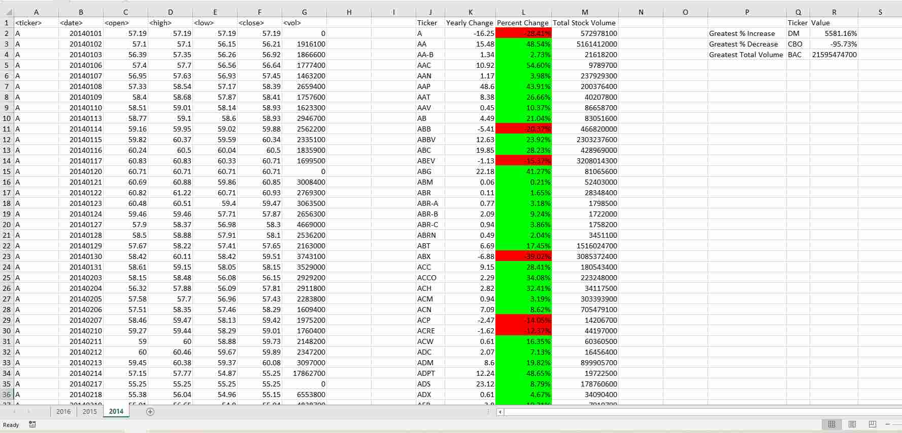
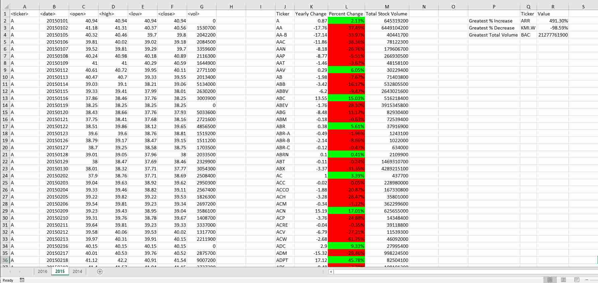
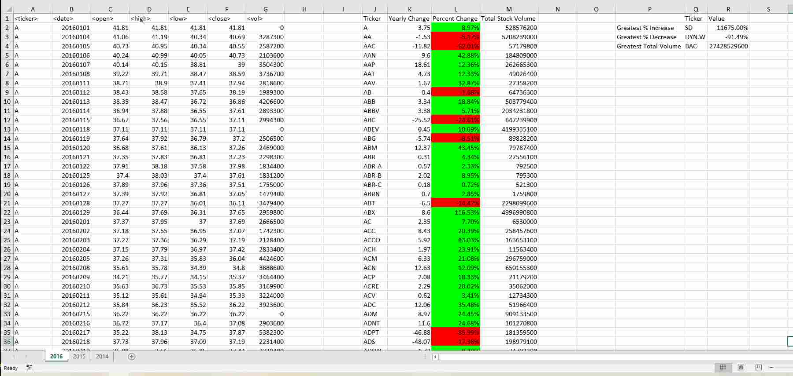

# VBA-challenge

This project aggregates daily stock trading data by ticker and by year for 2014,2015 and 2016. For each ticker it generates absolute and percentage yearly change, as well as total volume traded per year.
For each year analyzed it identified ticker with greatest percentual decrease and increase, and the ticker with greatest total volume traded.   
The examples of results for each analyzed year are included as below:

